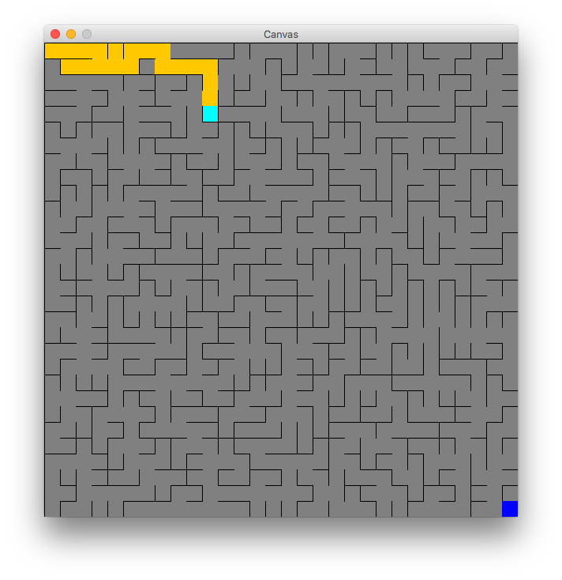
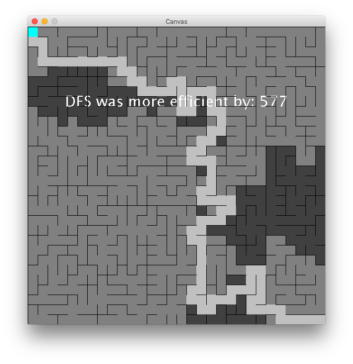
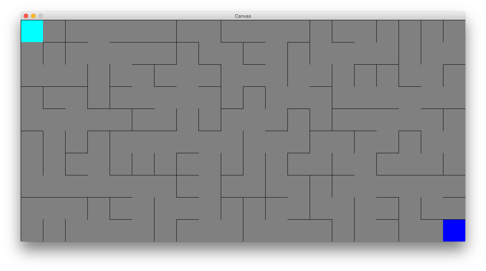
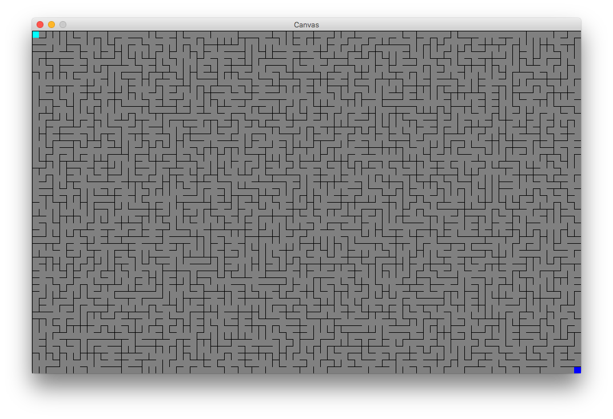
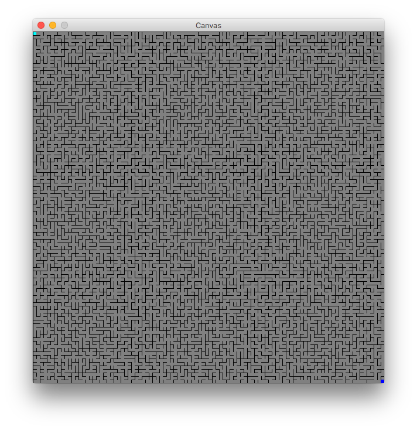

# Maze
CS2510 Fundamentals of Computer Science II (Spring 2016): Project 2

**Collaborators**: Yangsoo Song, Thomas Harmon

**Course Website**: https://course.ccs.neu.edu/cs2510/

## Introduction
This is a maze game where players must try to escape by navigating their way
from the top-left of the maze to the bottom-right. Each maze is different, and
there are mazes of all different sizes.

## How to Play
You are the aqua blue square in the top-left corner. The objective is to reach the
dark blue square in the bottom-right corner. You navigate your player using the arrow
keys. If you want to generate a different maze to play, you can press "R" to
reset the game. If you want to solve the maze using Depth-first search (DFS),
press "D". If you want to solve it using Breadth-first search (BFS), press "B".

As you move, your path will be highlighted in orange.

Similarly, if you choose to have the maze solved for you, the path of the search
will be highlighted in light blue. The display will also show you how much paths
can be saved by using DFS vs BFS.

## How to Change Map Dimensions
The maze can be resized by changing the `MAZE_HEIGHT` and `MAZE_WIDTH` variables
in the `Maze` class.

*Example 10x20 Maze*

*Example 50x80 Maze*

*Example 100x100 Maze*

## Classes/Methods
The player class has three fields: `row` & 'col', which keep track of the
player’s position according to the `Node` that s/he is on, and `nCell'
visited`, which is Number of the cell that the player is on.

In the `Maze` class, `initMaze()` initializes the 'Node's of the maze. 
It set all the walls to up initially. 
'initMazeList()' initializes the 1d maze like the 2d maze
'initWorkList()' initializes the worklist of all possible edges. Set random weights as well.

Then perfrom 'union' which links a representative to another representative
and 'find' if a node name maps to itself, then it is the representative; otherwise,
follow the links in the representatives map, and recursively look up 
the representative for the current node's parent.
and it takes in either a `Stack` or a `Queue`, depending on the search (which is set in `onKey()`).

## How to Run the Game
1. Download Eclipse: https://www.eclipse.org/ide/
2. Pull this repository and set [`EclipseWorkspace`](/EclipseWorkspace) as
the workspace, or import [`Mazes`](/EclipseWorkspace/Mazes) into the workspace
3. Import the two external `.jar` files in [`EclipseJars`](/EclipseJars) into
the build path
4. In the run configurations, set the main class as `tester.Main` and the
program arguments as `ExampleMaze`
5. Run the program
